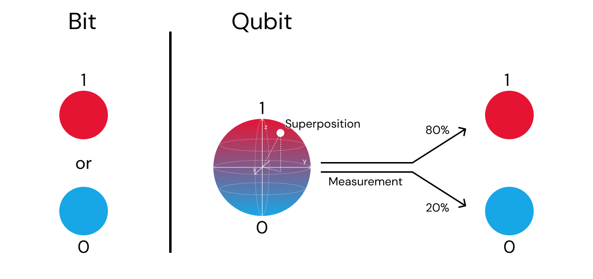

## Visual Overview

### Classical vs Quantum

### Quantum Gates

# quantum-for-software-engineers

Learn quantum computing the way software engineers think.

> A code-first, intuition-driven collection of resources, tools, and platforms for understanding quantum computing without heavy physics or math.

---
## Visual Overview

### Classical vs Quantum

### Quantum Gates

---

## What You Will Learn (Conceptually)

- Qubits as stateful computational objects
- Quantum gates as transformations
- Circuits as execution pipelines
- Measurement as probabilistic output
- Entanglement as shared system state
- How quantum computers differ from classical computers *in practice*
- Where quantum computing is useful today (and where it is not)

---

## Core Quantum Software Frameworks

### Qiskit (IBM)
- https://qiskit.org
- https://github.com/Qiskit/qiskit
- https://learning.quantum.ibm.com

Primary use:
- circuit design
- simulation
- real quantum hardware access

Key components:
- `qiskit.circuit`
- `qiskit.quantum_info`
- `qiskit_aer`
- `qiskit_ibm_runtime`

---

### PennyLane (Xanadu)
- https://pennylane.ai
- https://github.com/PennyLaneAI/pennylane

Primary use:
- hybrid quantum–classical computing
- quantum machine learning
- differentiable quantum circuits

Integrates with:
- PyTorch
- TensorFlow
- JAX

---

### Cirq (Google)
- https://quantumai.google/cirq
- https://github.com/quantumlib/Cirq

Primary use:
- NISQ-era algorithms
- hardware-aware circuit design
- research-focused workflows

---

### Braket SDK (AWS)
- https://github.com/aws/amazon-braket-sdk-python
- https://aws.amazon.com/braket/

Primary use:
- cloud-native quantum workflows
- access to multiple quantum hardware providers
- scalable experimentation

---

### Q# (Microsoft)
- https://learn.microsoft.com/azure/quantum/
- https://github.com/microsoft/qsharp

Primary use:
- algorithm design
- quantum program composition
- tight integration with classical control logic

---

## Quantum Simulation Tools

Used when real quantum hardware is unavailable or impractical.

- Qiskit Aer  
  https://qiskit.org/ecosystem/aer/

- Cirq Simulator  
  https://quantumai.google/cirq/simulators

- QuTiP  
  https://qutip.org

- ProjectQ  
  https://projectq.ch

---

## Cloud Quantum Platforms (Hands-On)

### IBM Quantum
- https://quantum.ibm.com
- Free tier available
- Real superconducting quantum processors

---

### Amazon Braket
- https://aws.amazon.com/braket/
- Access to IonQ, Rigetti, QuEra
- Pay-as-you-go model

---

### Azure Quantum
- https://azure.microsoft.com/products/quantum
- Multi-vendor quantum access
- Strong tooling and documentation

---

## Types of Quantum Computers (Engineering View)

### Superconducting Qubits
Used by:
- IBM
- Google
- Rigetti

Characteristics:
- fast gate times
- cryogenic temperatures
- microwave control

---

### Trapped Ion Quantum Computers
Used by:
- IonQ
- Quantinuum

Characteristics:
- high-fidelity gates
- long coherence times
- slower operations than superconducting systems

---

### Photonic Quantum Computers
Used by:
- Xanadu
- PsiQuantum

Characteristics:
- room-temperature operation
- optical components
- strong potential for scalability

---

### Neutral Atom Quantum Computers
Used by:
- QuEra
- Pasqal

Characteristics:
- optical tweezers
- good scalability
- emerging hardware model

---

### Quantum Annealers
Used by:
- D-Wave

Characteristics:
- optimization-focused
- not gate-based
- specialized problem domain

---

## Quantum Hardware Providers

- IBM Quantum  
  https://quantum.ibm.com

- Google Quantum AI  
  https://quantumai.google

- IonQ  
  https://ionq.com

- Rigetti  
  https://www.rigetti.com

- Quantinuum  
  https://www.quantinuum.com

- Xanadu  
  https://www.xanadu.ai

- D-Wave  
  https://www.dwavesys.com

---

## Learning Resources (High Quality)

### Beginner-Friendly
- IBM Quantum Learning Platform  
  https://learning.quantum.ibm.com

- Qiskit Textbook  
  https://qiskit.org/learn

- Microsoft Quantum Katas  
  https://github.com/microsoft/QuantumKatas

---

### Academic & Reference
- Nielsen & Chuang — *Quantum Computation and Quantum Information*
- MIT OpenCourseWare – Quantum Computation  
  https://ocw.mit.edu

- Stanford Quantum Courses  
- Oxford Quantum Group Resources

---

## Quantum Computing + Software Engineering

### Mental Model Mapping

| Software Engineering | Quantum Computing |
|----------------------|-------------------|
| Variable             | Qubit             |
| Function             | Quantum Gate      |
| Pipeline             | Quantum Circuit   |
| Randomized algorithm | Measurement       |
| Shared memory        | Entanglement      |

---

## Programming Languages Used in Quantum

- Python (dominant)
- Q#
- C++ (hardware control layers)
- Rust (emerging ecosystems)

---

## Industry & Ecosystem

Quantum computing is relevant to:
- optimization
- chemistry & materials
- machine learning research
- simulation of physical systems
- information theory

Major contributors:
- IBM
- Google
- Microsoft
- Amazon
- Intel
- Startups and research labs worldwide

---

## How to Use This Repository

- Pick a framework
- Run examples
- Observe probabilistic behavior
- Compare simulators vs real hardware
- Build intuition through experimentation

---

## Philosophy

> Quantum computing is not magic.
> It is computation under different rules of information, state, and probability.

---

If this repository helps you explore quantum computing as a software engineer,
consider starring it and sharing it with others.

- Curious Developers

##  Contributing
Pull requests are welcome.

⭐ If this repository helps you, please consider starring it.
